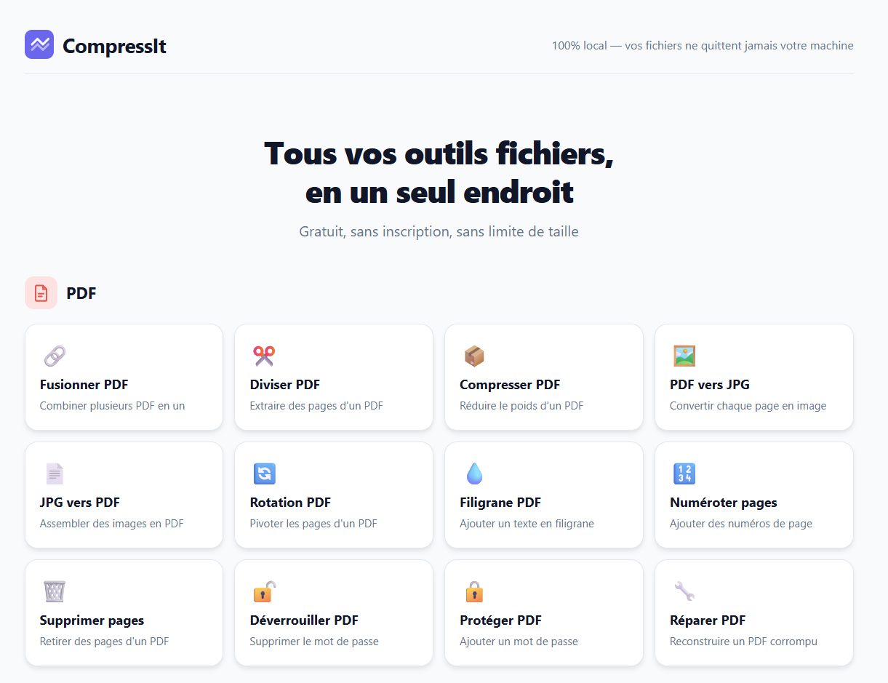

# CompressIt

**Outils fichiers gratuits, 100% locaux — images, PDF, vidéos, archives.**

[](https://github.com/Enzo0673/compressit/releases/latest)
[](LICENSE)
[](https://github.com/Enzo0673/compressit/actions)

> 🖥️ **[Essayer en ligne](https://compressit.onrender.com)** · 📥 **[Télécharger l'app locale](https://github.com/Enzo0673/compressit/releases/latest)**

<!-- Screenshot : remplacer par un vrai GIF ou image après la première exécution -->
<!--  -->

---

## ⬇️ Télécharger l'application

| Plateforme | Lien |
|---|---|
| **Windows** | [CompressIt.exe](https://github.com/Enzo0673/compressit/releases/latest/download/CompressIt.exe) |
| **macOS** | [CompressIt-macOS.zip](https://github.com/Enzo0673/compressit/releases/latest/download/CompressIt-macOS.zip) |
| **Linux** | [CompressIt-Linux.tar.gz](https://github.com/Enzo0673/compressit/releases/latest/download/CompressIt-Linux.tar.gz) |

Double-cliquez sur l'exécutable → l'application s'ouvre dans votre navigateur. **Aucune installation requise.**

> Une version en ligne est également disponible pour tester sans rien installer — les fichiers transitent alors par notre serveur et sont supprimés après 1h.

---

## Outils disponibles

### PDF (11 outils)
| Outil | Description |
|---|---|
| Compresser PDF | Réduire le poids d'un PDF |
| Fusionner PDF | Combiner plusieurs PDF en un seul |
| Diviser PDF | Extraire des pages ou découper un PDF |
| PDF → JPG | Convertir chaque page en image JPG |
| JPG → PDF | Assembler des images en PDF |
| Rotation PDF | Faire pivoter des pages |
| Filigrane PDF | Ajouter un texte en filigrane |
| Numéroter pages | Ajouter des numéros de page |
| Supprimer pages | Retirer des pages d'un PDF |
| Déverrouiller PDF | Supprimer la protection par mot de passe |
| Protéger PDF | Ajouter un mot de passe |

### Images (5 outils)
| Outil | Description |
|---|---|
| Compresser image | Réduire le poids — JPEG, PNG, WebP, GIF, BMP, TIFF |
| Redimensionner | Changer les dimensions |
| Convertir format | Passer d'un format à un autre |
| Recadrer | Rogner une image |
| Rotation / Flip | Faire pivoter ou retourner |

### Vidéo
- **Compresser vidéo** — MP4, MOV, AVI, MKV, WebM (codecs H.264 / H.265 / VP9)

### Archives
- **Compresser archive** — ZIP, 7z, RAR, TAR, GZ, BZ2, ZST (algorithmes zstd, lzma, gzip, brotli)

---

## Pourquoi CompressIt ?

Les outils en ligne comme iLovePDF ou Smallpdf envoient vos fichiers sur leurs serveurs. Avec l'app locale, CompressIt tourne entièrement sur votre machine :

- **100% local** — vos fichiers ne transitent jamais par internet
- **Aucune collecte** — pas de cookies, pas d'analytics, pas de compte requis
- **Open source** — le code est auditable
- **PWA** — installable comme une app, fonctionne hors-ligne

---

## Développement

### Prérequis

- Python 3.10+
- FFmpeg dans le PATH (compression vidéo)
- Poppler (PDF → JPG) : `apt install poppler-utils` / `brew install poppler` / [Windows](https://github.com/oschwartz10612/poppler-windows/releases)

### Démarrage

```bash
git clone https://github.com/Enzo0673/compressit.git
cd compressit
pip install -r requirements.txt
py main.py        # Windows
python main.py    # Linux / Mac
```

### Build de l'exécutable

```bash
pip install pyinstaller

# Placer les binaires FFmpeg + Poppler dans bin/
# (voir compressit.spec pour les noms attendus)

pyinstaller compressit.spec
# → dist/CompressIt.exe (Windows) ou dist/CompressIt (Mac/Linux)
```

Les builds sont automatisés via GitHub Actions à chaque tag `v*`.

---

## Stack technique

| Composant | Technologie |
|---|---|
| Backend | Python 3, FastAPI, Uvicorn |
| Images | Pillow |
| PDF | pikepdf, pdf2image |
| Vidéo | ffmpeg-python + FFmpeg |
| Archives | zstandard, brotli, lzma, gzip |
| Frontend | HTML / CSS / JavaScript vanilla |
| Aperçu PDF | pdf.js (servi en local) |
| PWA | Service Worker + manifest.json |
| Build | PyInstaller + GitHub Actions |

---

## Sécurité

- CORS restreint à `localhost`
- Validation des paramètres côté serveur (whitelists codec, DPI, qualité…)
- Protection path traversal sur les téléchargements
- Protection zip bomb sur les archives (ratio, taille décompressée)
- Fichiers temporaires supprimés automatiquement après 1 heure
- Aucune stack trace exposée au client

---

## Licence

[MIT](LICENSE)
